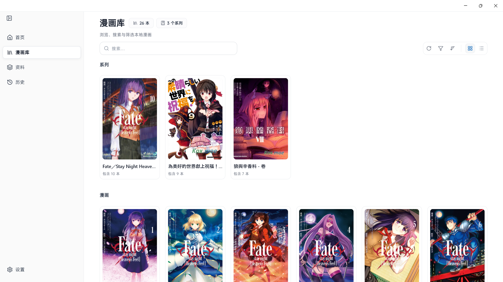
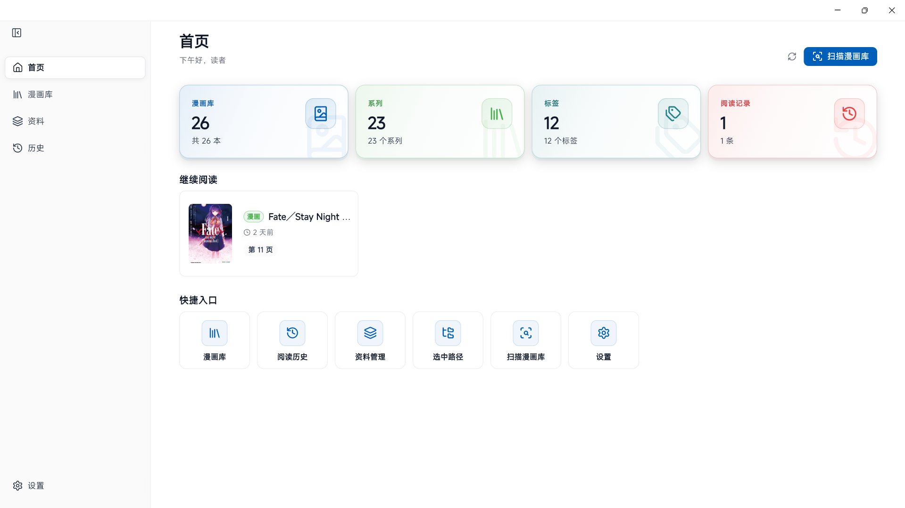
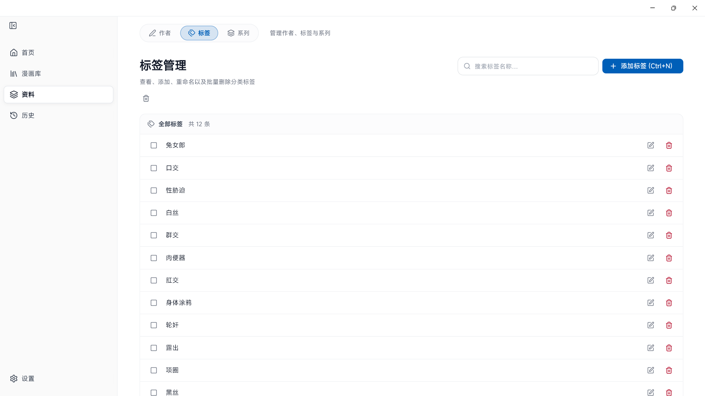
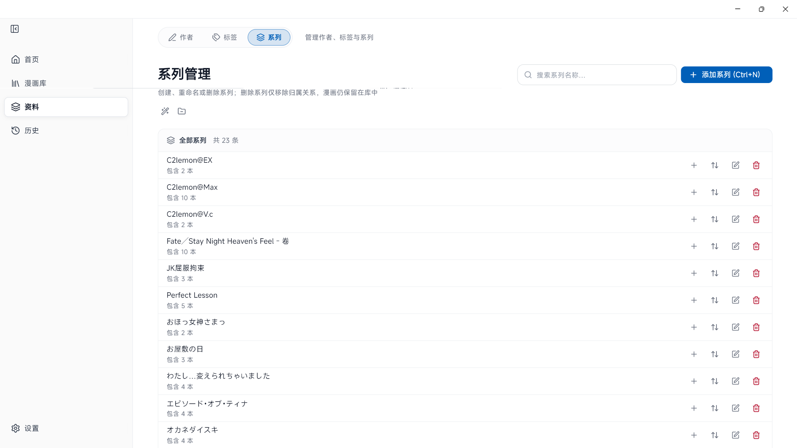
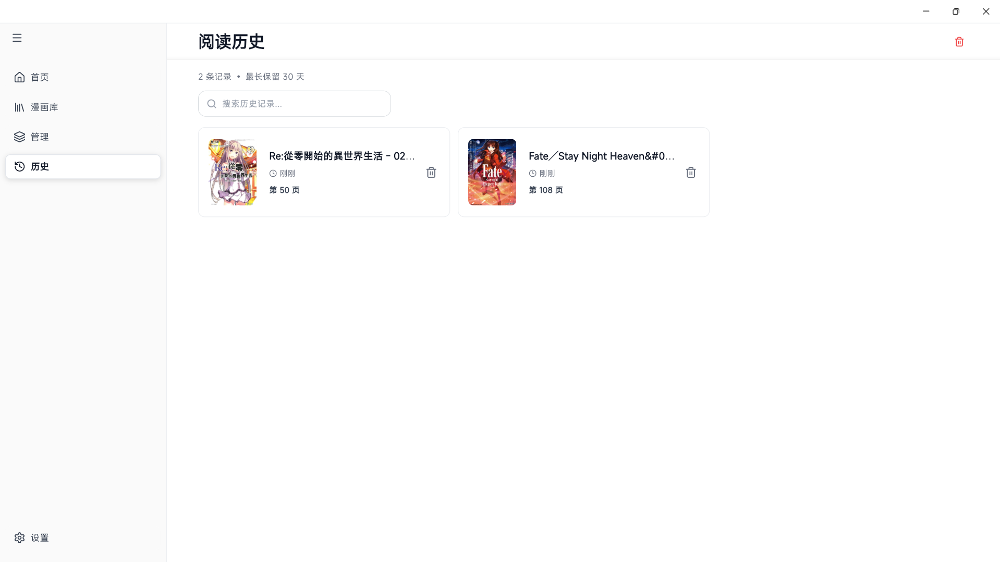
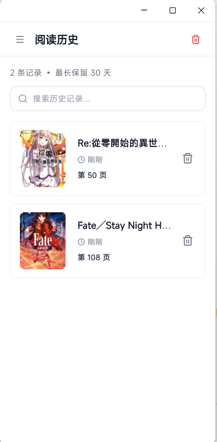

# Hentai Library

基于 Flutter 的本地漫画/本子阅读与管理应用，聚焦离线阅读体验与个人库管理。

## 屏幕截图

<table>
 <tr>
    <td></td>
    <td></td>
    <td></td>
  <tr>
  <tr>
    <td></td>
    <td></td>
    <td></td>
  <tr>
</table>

## 核心功能

### 阅读器

- 资源格式支持: `EPUB`, `ZIP`, `CBZ`
- 图片格式支持: `JPG`、`PNG`、`WebP`
- 多阅读模式：卷轴（Webtoon）、翻页
- 阅读增强：预加载，亮度，自动播放

### 书架与库管理

- 指定路径扫描与导入
- 自定义元数据(作者,标签,内容分级,首发日期)
- 创建系列管理相关漫画
- 自动系列推断

## 支持平台

| 平台    | 支持情况 |
| ------- | -------- |
| Android | ❌       |
| iOS     | ❌       |
| Windows | ✅       |
| macOS   | ❌       |
| Linux   | ❌       |

## 协作建议

- 提交前至少执行：`dart format .`、`flutter analyze`、`flutter test`
- 新增模型/DAO/Provider 后同步更新生成代码
- PR 说明建议包含：改动背景、核心改动点、测试方式、截图（UI 改动）
- PR 说明建议包含：改动背景、核心改动点、测试方式、截图（UI 改动）
