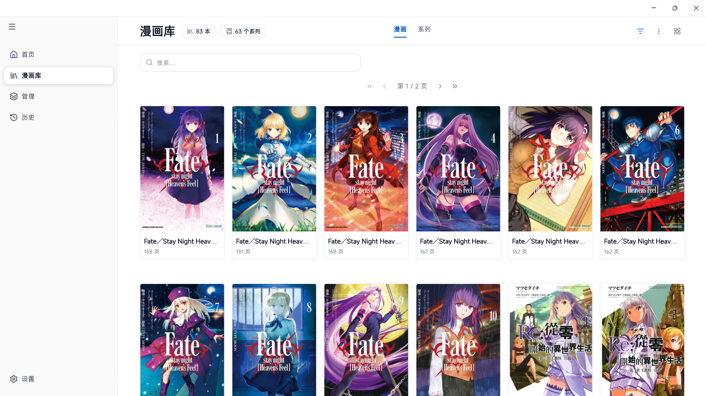
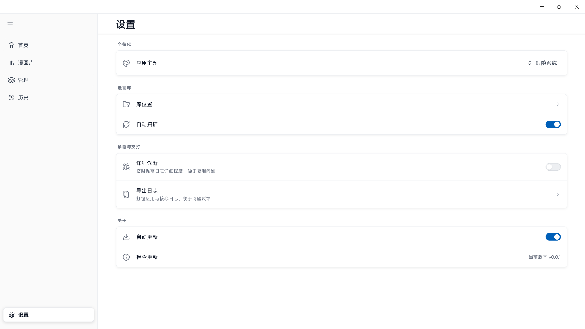
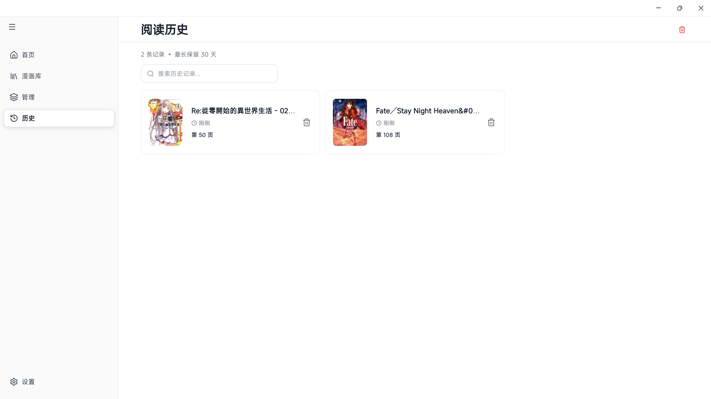
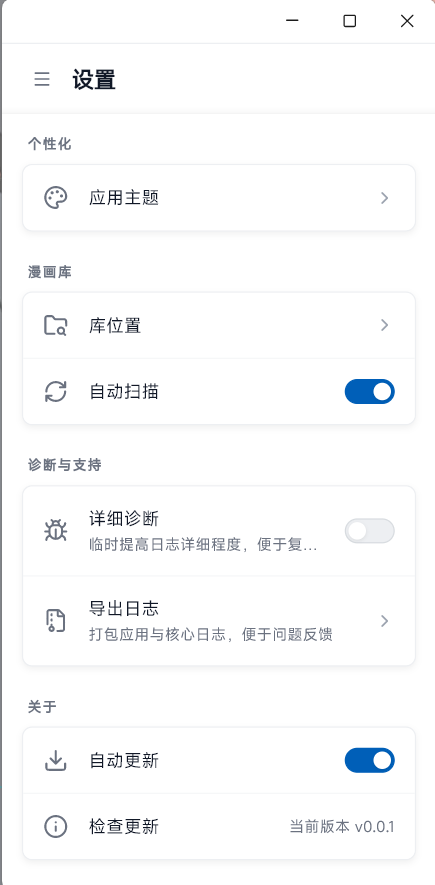

# Hentai Library

基于 Flutter 的漫画阅读与管理应用，面向个人库（本地文件夹根或用户自建 WebDAV），聚焦阅读体验与库管理。

## 屏幕截图

| 漫画库（桌面 / 紧凑） | 设置（桌面 / 紧凑） | 阅读历史（桌面 / 紧凑） |
| --- | --- | --- |
|  |  |  |
|  |  |  |

## 核心功能

### 阅读器

- **资源格式**：图片目录、`ZIP` / `CBZ`、`EPUB`、`PDF`；`RAR` / `CBR`、`7Z` / `CB7` 已识别并纳入同步
- **图片格式**：`JPG`、`PNG`、`WebP`、`BMP`、`GIF`
- **阅读模式**：单页翻页、双页、双页（封面独立）、Webtoon 纵向卷轴
- **阅读增强**：相邻页预加载、翻页模式自动播放、全屏阅读、阅读进度与历史记录
- **系列阅读**：在系列内切换上下卷；支持无痕阅读（不写入历史）

### 书架与库管理

- 多 Library：每个库一个根（本地文件夹，或用户自建 WebDAV）
- 按库扫描与同步（本地可离线阅读；WebDAV 需网络）
- 自定义元数据（作者、标签、内容分级、首发日期）
- 创建系列管理相关漫画
- 自动系列推断
- 漫画库筛选：年龄限制、媒体类型（PDF / EPUB / 压缩包）、排序

## 支持平台

| 平台    | 支持情况 |
| ------- | -------- |
| Android | ✅       |
| iOS     | ✅       |
| Windows | ✅       |
| macOS   | ✅       |
| Linux   | ✅       |

## 协作建议

本仓库为 **Monorepo**：Flutter 应用在 `app/`，Rust 核心位于 `core/`。

### 首次 / clone 后初始化

Cargokit 通过 `app/rust_builder/rust` 链接到 `core/crates/flutter` 来编译 Rust；该链接不会提交到 Git，需本地创建一次：

```bash
# 仓库根目录（Linux / macOS / Windows Git Bash）
./scripts/setup-dev.sh
```

脚本会：

1. 创建 `app/rust_builder/rust` → `core/crates/flutter` 的符号链接（Windows 为 junction）
2. 下载 pdfium 等原生依赖到 `core/vendor/`

仅需链接、跳过依赖下载时：`./scripts/setup-dev.sh --skip-native-deps`。

### 日常开发

```bash
cd app
flutter pub get
dart run build_runner build --delete-conflicting-outputs
dart format .
flutter analyze
flutter test
flutter run -d windows   # 或其他平台
```

- PR 硬门禁与本地 Gate：仓库根执行 `./scripts/run-gate.sh`（见 `docs/agents/testing.md`）
- 合并前若改了 UI 或怀疑 widget 回归，再跑全量：`cd app && flutter test`
- 新增/改动需代码生成的 Dart 模型或 Provider 后，同步跑 `build_runner`（业务持久化在 Rust/SeaORM，无 Drift DAO）
- PR 说明建议包含：改动背景、核心改动点、测试方式、截图（UI 改动）
